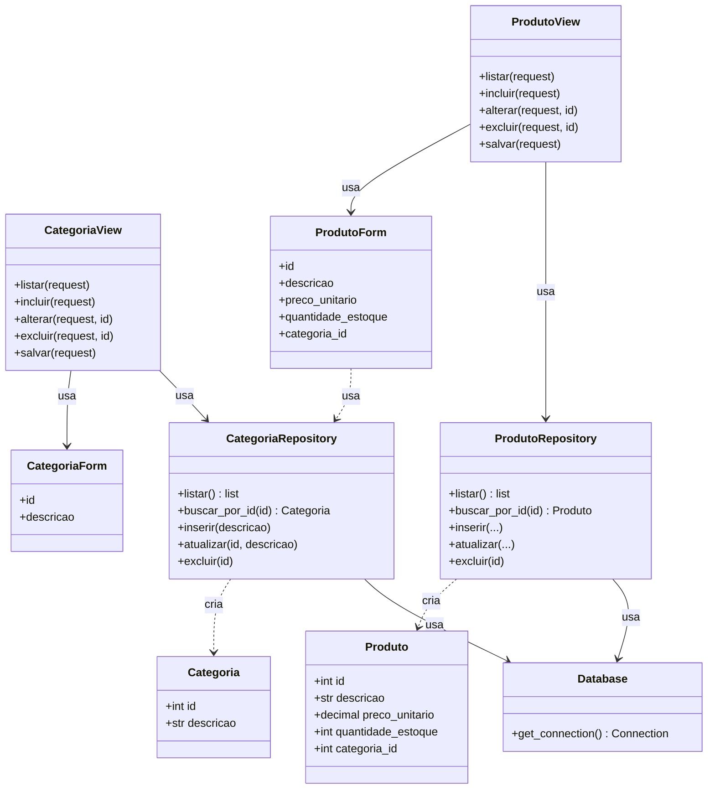

# Trabalho SOLID 1 — Princípio da Responsabilidade Única (SRP)

**Disciplina:** Arquitetura de Software — Prof. Dr. Fabiano Papaiz
**Projeto:** Web Store (Django) — cadastro de Categorias e Produtos

---

## 1. Problema identificado no código original

O arquivo `app/views.py` continha duas funções (`categorias()` e `produtos()`) que
concentravam **quatro responsabilidades diferentes** cada uma:

1. Abrir e gerenciar a conexão com o banco de dados
2. Montar e executar comandos SQL (SELECT, INSERT, UPDATE, DELETE)
3. Validar dados através de formulários Django
4. Interpretar a rota HTTP e decidir qual template renderizar

Isso é exatamente o "código espaguete" descrito no slide da disciplina: uma única
função com **múltiplos motivos para ser modificada** — uma mudança no schema do
banco, uma mudança na regra de validação do formulário, ou uma mudança na lógica
de roteamento HTTP, todas mexeriam no mesmo lugar.

Além disso, as consultas eram montadas com f-string, concatenando diretamente o
valor recebido do formulário no SQL (ex: `f"DELETE FROM Categoria WHERE id = {form_data['id']}"`),
o que deixava a aplicação vulnerável a SQL Injection.

---

## 2. Diagrama de classes (feito antes da implementação)



Cada classe/módulo tem **um único motivo para mudar**:

| Classe | Responsabilidade única |
|---|---|
| `Database` | Fornecer a conexão com o banco |
| `Categoria` / `Produto` | Representar os dados da entidade (nada de SQL ou HTTP) |
| `CategoriaRepository` / `ProdutoRepository` | Acesso a dados (CRUD) daquela entidade |
| `CategoriaForm` / `ProdutoForm` | Definir campos e validar dados de entrada |
| `categorias()` / `produtos()` (views) | Orquestrar a requisição HTTP e escolher o template |

---

## 3. Estrutura de arquivos após a refatoração

```
utils/
  database.py        # NOVO — única responsabilidade: abrir conexão
app/
  models_domain.py    # NOVO — entidades Categoria e Produto
  repositories.py      # NOVO — CategoriaRepository e ProdutoRepository (todo o SQL)
  forms.py             # NOVO — CategoriaForm e ProdutoForm (antes viviam em views.py)
  views.py             # REFATORADO — só orquestra HTTP, sem SQL nenhum
  templates/
    categorias_listar.html   # ajustado: reg.0/reg.1 -> reg.id/reg.descricao
    produtos_listar.html     # ajustado: reg.0..reg.5 -> reg.id/reg.descricao/...
```

Nenhum outro arquivo (CSS, imagens, `base.html`, templates de edição, `settings.py`,
`urls.py`, `manage.py`, banco de dados) foi alterado — a interface e o comportamento
da aplicação permanecem idênticos.

---

## 4. O que mudou em cada arquivo

### `utils/database.py` (novo)
Classe `Database` com um único método estático `get_connection()`. Se um dia a
aplicação trocar de SQLite para outro banco, só este arquivo precisa mudar.

### `app/models_domain.py` (novo)
`Categoria` e `Produto` como `dataclasses` simples — apenas os campos, sem
nenhuma lógica de banco ou de formulário.

### `app/repositories.py` (novo)
Todo o SQL que estava em `views.py` foi movido para cá:
- `CategoriaRepository`: `listar()`, `buscar_por_id()`, `inserir()`, `atualizar()`, `excluir()`
- `ProdutoRepository`: os mesmos métodos, incluindo o `JOIN` com Categoria na listagem

As queries passaram a usar parâmetros (`?`) em vez de f-string, corrigindo a
vulnerabilidade de SQL Injection do código original.

### `app/forms.py` (novo)
`CategoriaForm` e `ProdutoForm` saíram de `views.py`. O `ProdutoForm` não abre
mais conexão própria com o banco para carregar o `<select>` de categorias — ele
pede a lista ao `CategoriaRepository`.

### `app/views.py` (refatorado)
As funções `categorias()` e `produtos()` continuam recebendo as mesmas rotas
(`acao`, `id`), mas agora apenas:
1. Chamam o repositório correspondente para ler/gravar dados
2. Escolhem o template certo com o contexto certo

Nenhuma linha de SQL restou neste arquivo.

### Templates de listagem (ajustados)
Como o repositório agora retorna objetos `Categoria`/`Produto` (e não mais
tuplas cruas do SQL), os templates passaram a acessar os dados por nome do
atributo (`reg.id`, `reg.descricao`, `reg.categoria`...) em vez de índice de
tupla (`reg.0`, `reg.1`...). Essa foi a única mudança de interface, e é
puramente técnica — a tela renderiza exatamente igual.

---

## 5. Validação

O projeto refatorado foi executado com `python manage.py runserver` contra o
`db_solid.sqlite3` original, testando:

- `/` (home) — OK
- `/categorias/` (listagem) — OK, exibe os registros corretamente
- `/produtos/` (listagem) — OK, exibe o JOIN com categoria corretamente
- `/categorias/incluir/` e `/produtos/incluir/` (telas de inclusão) — OK

---

## 6. Conclusão

A refatoração aplicou o **Princípio da Responsabilidade Única (SRP)** dividindo
uma função que fazia "tudo" (conexão, SQL, validação, roteamento) em classes
menores e coesas, cada uma com um único motivo para mudar — o mesmo raciocínio
demonstrado no exemplo da classe `Funcionario` visto em aula. O resultado é um
código mais fácil de manter, testar e estender.
